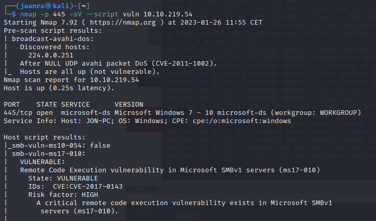

# Blue

# Enumeración de servicios

Ejecutaremos el siguiente escaneo para la búsqueda de vulnerabilidades en los servicios:

```bash
nmap -p 445 -sV --script vuln 10.10.219.54
```



**CVE**

> CVE-2017-0143
> 

**Puertos y servicios**

> SMB port: 445/tcp
> 

# Explotación de la vulnerabilidad

## SMB exploiting

Abrimos msfconsole y buscamos el CVE, usamos eternalblue:


Asignamos LHOST a la IP de nuestra VPN:


Asignamos el RHOSTS a la IP de la máquina:


Asignamos el payload que vamos a usar, en este caso la reverseshell:


Explotamos


Dejamos en background


## Upgrade shell to meterpreter

Buscamos shell_to_meterpreter y cambiamos el payload:


Listamos las sesiones:


Seleccionamos la sesión que vamos a utilizar y ejecutamos el exploit:


Abriendo la sesión de meterpreter (se abre sola, sólo tenemos que ver cuál es la de meterpreter)


E iniciamos la sesión de meterpreter:


## Crackeando contraseñas

Con hashdump podemos hacer un volcado de los hashes de cada usuario de windows:


Creamos un directorio para la máquina de THM. Dentro de él guardamos los hashes en un fichero llamado hashes


## Búsqueda de flags

John the ripper tiene una opción para crackear los hashes de NT:

john --wordlist=~/diccionarios/rockyou.txt --format=NT hashes


Una vez hemos extraído la contraseña, nos vamos hasta el directorio C:


Encontramos la primera flag.

Una vez hecho esto nos vamos a C:\Windows\system32\config que es donde están almacenados los registros:


Encontramos la segunda flag.

A continuación, entraremos en el directorio ubicado en C:\Users\Jon\Documents:


Encontramos la última flag.