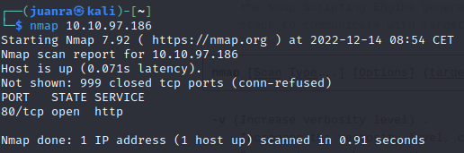

# Easy Peasy

## Port enumeration

Empezamos enumerando los puertos abiertos con un nmap simple:

```bash
nmap -p- -sV <ip_de_la_maquina>
```

Pero nos muestra nada más que el puerto 80 abierto.



Por tanto, vamos a probar con un scan más intenso, buscando, ya de paso, las versiones de los servicios de los puertos abiertos:

```bash
nmap -p- -sV 10.10.97.186
```


Encontramos tres puertos abiertos: tcp, ssh y http.

La versión de nginx es: la 1.16.1

## Directory fuzzing

Ahora vamos a hacer fuzzing a los directorios de la máquina:

```bash
gobuster dir -u http://<ip_de_la_maquina> -w /usr/share/wordlists/dirbuster/directory-list-2.3-medium.txt
```

Encontramos el directorio /hidden


Ahora haremos los mismo para el directorio /hidden:

```bash
gobuster dir -u http://<ip_de_la_maquina> -w /usr/share/wordlists/dirbuster/directory-list-2.3-medium.txt
```


En el directorio /hidden encontramos lo siguiente:


Encontramos el directorio /whatever, su contenido:


En el código fuente podemos observar lo que parece un base 64:


Vamos a   con el comando:

```bash
echo “<contenidodehidden>” | base64 -d
```

Obtenemos la primera flag

Nos vamos al apache entrando con el puerto 65524:


Buscamos en el código fuente de la máquina por la palabra “flag”.

Encontramos uno:


En el robots.txt encontramos una posible pista:

> User-Agent: a18672860d0510e5ab6699730763b250
> 


Con Hash-Identifier podemos averiguar el tipo de hash que es:

Resultó ser un MD5, ahora buscamos un decoder de MD5 en internet

Nos proporciona el segundo flag:

Volviendo al directorio /hidden anteriormente encontrado, hemos encontrado un posible hash dentro del código fuente:


> ObsJmP173N2X6dOrAgEAL0Vu
> 

Resulta ser un base 62

[Decodeamos](https://www.dcode.fr/base62-encoding) para ver qué es:


Nos proporciona lo que parece un directorio con el nombre de la famosa canción de Metallica:

> /n0th1ng3ls3m4tt3r
> 


En el código fuente de la página podemos encontrar un hash en un párrafo:


Descargamos el jpg del enlace, index.jpeg


## Esteganografía

Puede ser que sea una imagen con esteganografía, así que probaremos a extraer la imagen con steghide:

```bash
steghide --extract -sf index.jpeg
```


Sin embargo steghide nos pide un salvoconducto

### Hash bruteforce

El [párrafo](https://www.notion.so/Easy-Peasy-d4134bfcc4044fd1bf4e8ca29482b82d):

> 940d71e8655ac41efb5f8ab850668505b86dd64186a66e57d1483e7f5fe6fd81
> 

Pasándolo por hash-identifier parece que puede ser un GOST.

Vamos a intentar crackearlo con las contraseñas que nos proporciona Try Hack Me usando john the ripper, con el siguiente comando:

```bash
john --wordlist=easypeasy.txt --format=GOST hash.txt
```


Ahora extraemos las imágenes que aparecen en /n0th1ng3ls3m4tt3r :


binarycodepixabay.jpg y matrix-3109795_960_720.jpg

Para probar la contraseña en la esteganografía con el mismo comando usado anteriormente:


Hemos obtenido información del fichero esteganografiado. Probaremos a convertir el binario en texto:


Obtenemos una contraseña.

Ahora probaremos a iniciar sesión con SSH en la máquina con las credenciales anteriormente obtenidas:

