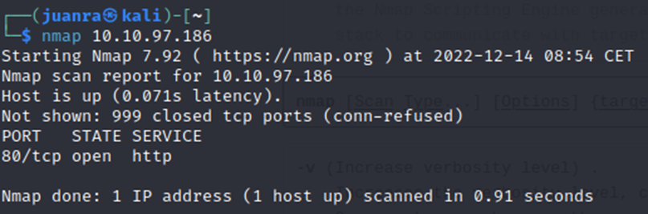
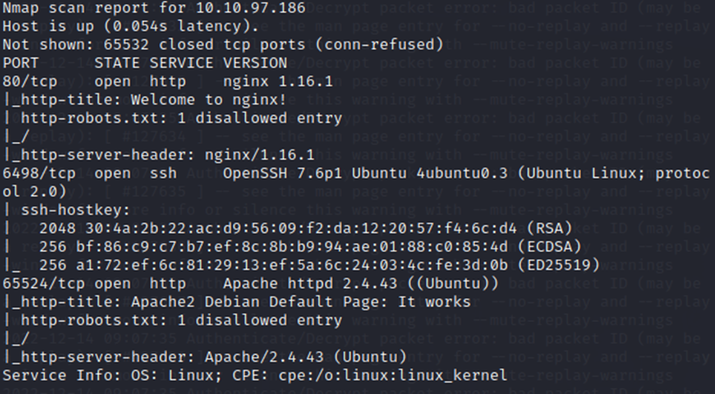
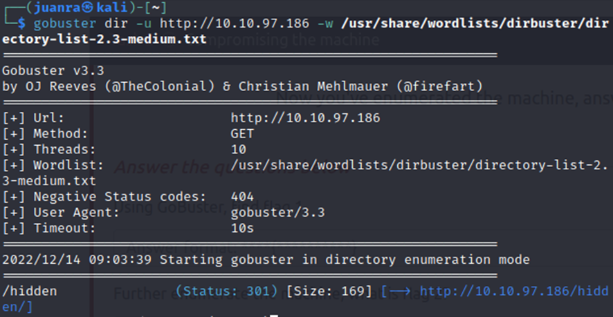
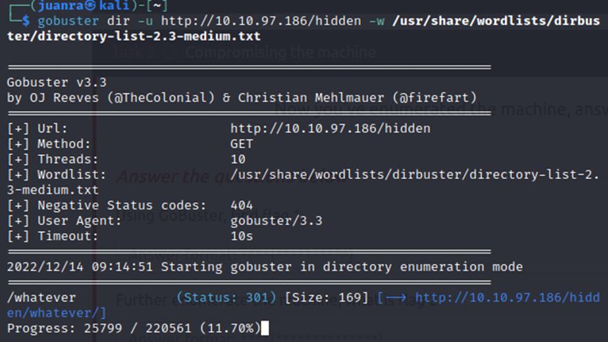
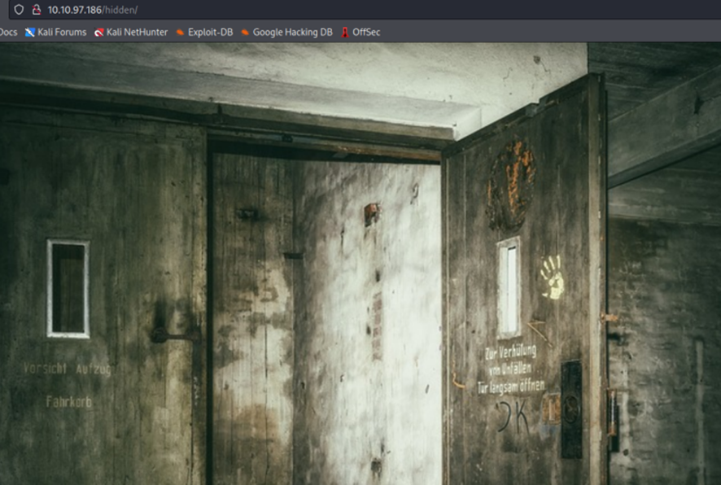
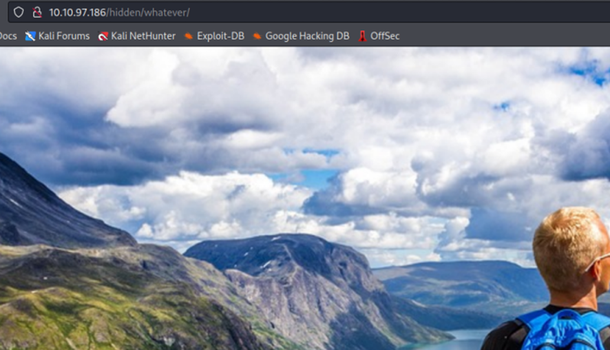
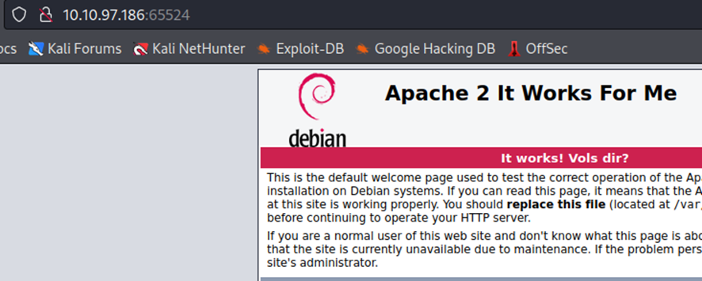
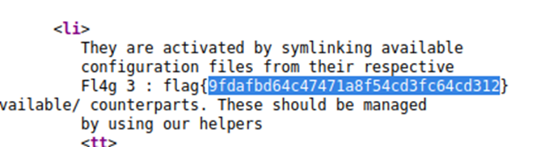
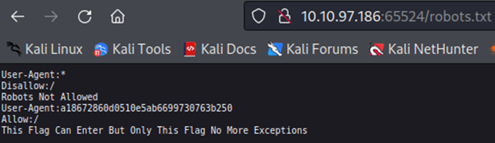

# Realización de la máquina Easy Peasy en THM

## Enumeración de puertos y versiones de servicios
Empezamos enumerando los puertos abiertos con un nmap simple:

>nmap 10.10.97.186 

Pero nos muestra nada más que el puerto 80 abierto.

Por tanto, vamos a probar con un scan más intenso, buscando, ya de paso, las versiones de los servicios de los puertos abiertos:

>nmap -p- -sV 10.10.97.186 

Encontramos tres puertos abiertos: **tcp, ssh y http**.

La **versión de nginx** es: la 1.16.1

## Directory listing

Ahora vamos a hacer fuzzing a los directorios de la máquina:

>gobuster dir -u http://10.10.97.186 -w /usr/share/wordlists/dirbuster/directory-list-2.3-medium.txt

Encontramos el directorio hidden

Ahora haremos lo mismo para el directorio hidden:

>gobuster dir -u http://10.10.97.186/hidden -w /usr/share/wordlists/dirbuster/directory-list-2.3-medium.txt

En el directorio hidden encontramos lo siguiente:

Encontramos el directorio whatever, el contenido:

Nos vamos al apache entrando con el puerto 65524:

Buscamos en el código fuente de la máquina por la palabra “flag”:

Encontramos uno

flag{9fdafbd64c47471a8f54cd3fc64cd312}

En el robots.txt encontramos la siguiente flag:

	User-Agent: a18672860d0510e5ab6699730763b250

Con Hash-Identifier podemos averiguar el tipo de hash que es:

Resultó ser un MD5, ahora buscamos un decoder de MD5 en internet:

Nos proporciona el segundo flag:

	flag{1m_s3c0nd_fl4g}

Volviendo al directorio /hidden anteriormente encontrado, hemos encontrado un posible hash dentro del código fuente:

	ObsJmP173N2X6dOrAgEAL0Vu

Resulta ser un base 62

Decodeamos para ver qué es:

Nos proporciona lo que parece un directorio con la famosa canción de Metallica  lml:

/n0th1ng3ls3m4tt3r

En el código fuente de la página podemos encontrar un hash en un párrafo:

Descargamos el jpg del enlace, index.jpeg

Puede ser que sea una imagen con esteganografía, así que probaremos a extraer la imagen con steghide:

	steghide --extract -sf index.jpeg  

	Sin embargo steghide nos pide un salvoconducto
	
El párrafo:

	940d71e8655ac41efb5f8ab850668505b86dd64186a66e57d1483e7f5fe6fd81

Parece un hash, así que vamos a intentar crackearlo con la contraseña que nos proporciona thm usando john the ripper, con el siguiente comando:

john --wordlist=easypeasy.txt --format=GOST hash.txt

Contraseña: mypasswordforthatjob 

Ahora extraemos las imágenes que aparecen en /n0th1ng3ls3m4tt3r : 

binarycodepixabay.jpg y matrix-3109795_960_720.jpg

Para probar la contraseña en la esteganografía con el mismo comando usado anteriormente: 

Hemos obtenido información del fichero esteganografiado. Probaremos a decodear el binario a texto:

	iconvertedmypasswordtobinary

Ahora probaremos a iniciar sesión con ssh en la máquina:

